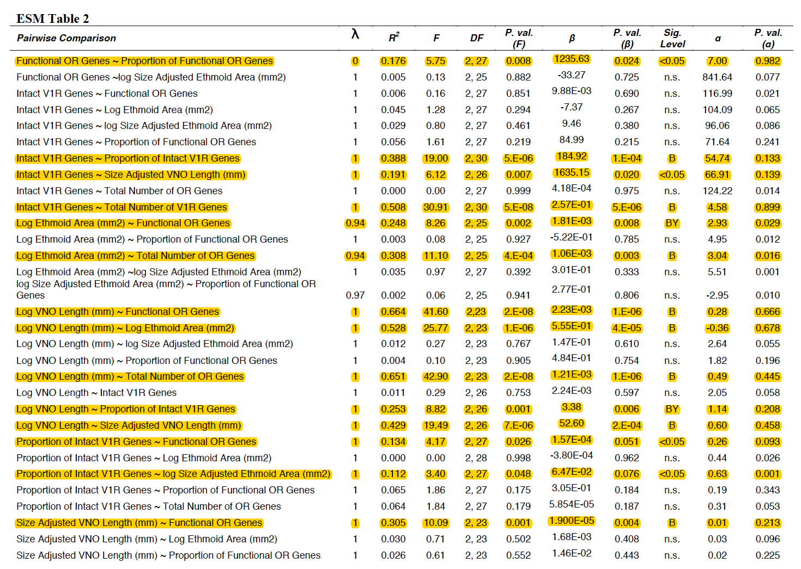
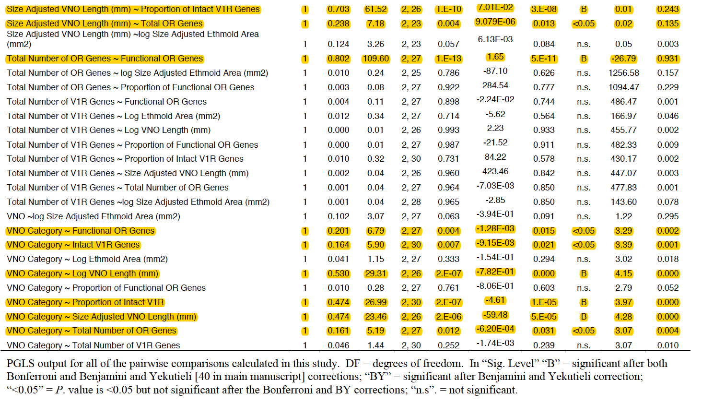
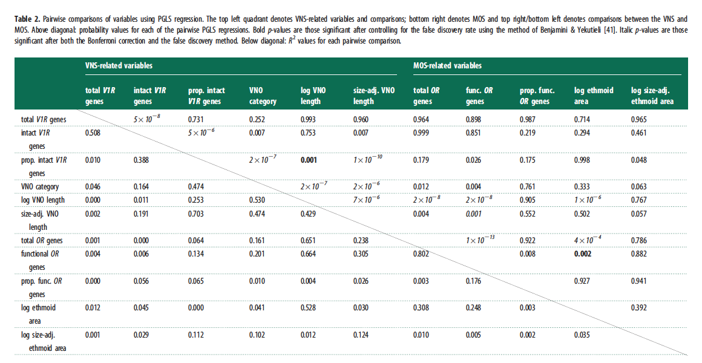
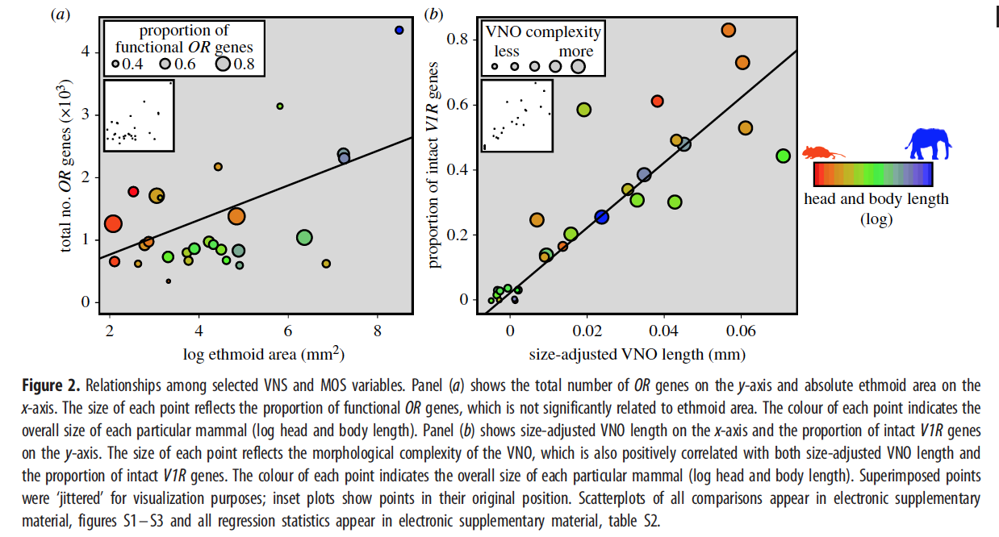

At last! At long last! Here is my final R project!! After everthing kind of fell apart with my intended project, I am very happy to be replicating a 2014 paper by Eva Garrett and Michael Steiper titled <i>Strong links between genomic and anatomical diversity in both mammalian olfactory chemosensory systems</i>. 

<br>This paper tested the relationships between the sizes of several skeletal structures and organs linked to the main olfactory and vomeronasal systems (MOS and VNS, respectively), as well as the number of both functional and total olfactory receptor (OR) or vomeronasal (V1R) genes (depending on the system). Additionally, all regressions were controlled for phylogenetic relatedness by using the phylogenetic least squares (PGLS) function from the caper package, which works by combining quantitative data with a phylogenetic tree (which I will provide on my GitHub repo). The paper concluded that the variation in MOS anatomical phenotypes is correlated more with total number of olfactory genes and gene family size, while variation in the VNS anatomical phenotypes is correlated more with the number of functional genes. 

<br>I am going to replicate a selection of the PGLS regression analyses in this paper, which I will explain later which ones I chose. I will also put the results through Post-Hoc testing, which will be specified later as well. Finally, to end on a nice note, I will attempt to replicate two graphs from the paper. 

##Preliminaries

Before I could begin this project in my R space, I had to take a few initial steps that I feel I should mention. First of all, Eva gave me the data in a PDF format, so I had to painstakingly convert the it to an Excel spreadsheet, reformat the entire dataset, check my work against the original to make sure all the values were correct, and convert that again to a CSV file that I can upload here. Additionally, in this process I deleted a few columns of data that I deemed unnecessary for my final dataset, which consisted of columns denoting specimen numbers for the anatomical samples and reference numbers for data citing. Finally, I took a liberty by adding a column called Example Species, because the file type I made to perform PGLS needed specific species names to lock in to on the tree instead of just the genus names that the data provides.  Below are pictures of the unedited dataset in PDF format.


##First Steps

Now, we are ready to read in my data and start the real work. For now we will start by loading in just the CSV file, because we need to add some additional columns to the dataset before we can do our PGLS. I have included this dataset in my GitHub repo for this project, so you can use a curl command to load it. 
<br> Just a disclaimer, an artifact of having to transform this data from a PDF format is that there"s some steps we will have to take to clean up the data more one we load it. 

```{r}
Olfaction <- read.csv(file="ESM_ALL GOOD ONE.csv", header=TRUE, sep=",")
head(Olfaction)
```

Now, we need to transform some of our morphological data. Garrett and Steiper transformed their data in a few ways. The first that I will do is to calculate and make a new column for the size-adjusted VNO and ethmoid area. 
<br>From the paper: "Size adjusted VNO data was calculated by dividing VNO length by head-body length"
<br> This is going to be a little bumpy, because converting data classes without fucking up your data is more complicated than it should be. Thanks to stack overflow for teaching me the unfactor() function from the varhandle package [2].
```{r}
library(varhandle)
#First, we need to change the class of the data

Olfaction$VNO.Length..mm. <- unfactor(Olfaction$VNO.Length..mm.)
Olfaction$VNO.Length..mm. <- as.numeric(Olfaction$VNO.Length..mm.)

Olfaction$Head.and.Body.Length..HBL...mm. <- as.numeric(Olfaction$Head.and.Body.Length..HBL...mm.)

#Now we can make the new column

Olfaction$VNO.Size.Adj <- Olfaction$VNO.Length..mm. / Olfaction$Head.and.Body.Length..HBL...mm.

```

Now, I will do the same for size adjusted ethmoid area. 
<br> From the paper: "Size adjusted ethmoid area was calculated by dividing ethmoid area by skull area"

```{r}
#Same as above, first, we need to change the class of the data
Olfaction$Ethmoid.Area..mm2. <- unfactor(Olfaction$Ethmoid.Area..mm2.)
Olfaction$Ethmoid.Area..mm2. <- as.numeric(Olfaction$Ethmoid.Area..mm2.)

Olfaction$Skull.Area..mm2. <- unfactor(Olfaction$Skull.Area..mm2.)
Olfaction$Skull.Area..mm2. <- as.numeric(Olfaction$Skull.Area..mm2.)

#Now we can make the new column

Olfaction$Ethmoid.Size.Adj <- Olfaction$Ethmoid.Area..mm2. / Olfaction$Skull.Area..mm2.

#Now take a look at our two new columns! 
head(Olfaction)
```

Next, we need to add a column for log-transformed ethmoid area, log-transformed VNO length, and log-transformed size-adjusted ethmoid area. They did not use a log-transformation for the size-adjusted VNO length in any of their PGLS calculations. 
<br>From the paper: "We(...)implemented the natural log transformation for non-corrected anatomical variables. When calculating the natural log transformation for VNO length we added one to our variable prior to transforming so all values were positive."
<br>I took a small liberty with this part, because I added 1 to the log size-adjusted ethmoid as well, so all the values were positive. 

```{r}
#For log ethmoid area: 

Olfaction$log.Ethmoid.Area <- log(Olfaction$Ethmoid.Area..mm2.)

#For log size-adjusted ethmoid area, using log1p to add 1:

Olfaction$log.Size.Adj.Ethmoid <- log1p(Olfaction$Ethmoid.Size.Adj)

#For log size-adjusted VNO, using log1p to add 1:

Olfaction$log.VNO <- log1p(Olfaction$VNO.Length..mm.)

#Now look at our new columns!

head(Olfaction)
```

Finally, we need to add two last columns. Not only did Garrett and Steiper test relationships with the numbers of intact V1R genes and number of functional OR genes, but they tested relationships with the proportions of intact V1R genes/functional OR genes out of the total number of V1R/OR genes. So, I will add two columns for the proportion of OR genes that are functional, and the proportion of V1R genes that are intact. I will do this by using basically the same method for making the size-adjusted VNO/ethmoid columns. I will start with OR genes.

```{r}
#First, convert data class

Olfaction$Functional.OR.Genes <- unfactor(Olfaction$Functional.OR.Genes)
Olfaction$Functional.OR.Genes <- as.numeric(Olfaction$Functional.OR.Genes)

Olfaction$Total.OR.Genes <- unfactor(Olfaction$Total.OR.Genes)
Olfaction$Total.OR.Genes <- as.numeric(Olfaction$Total.OR.Genes)

#Now we can make the new column

Olfaction$prop.functional.OR.Genes <- Olfaction$Functional.OR.Genes / Olfaction$Total.OR.Genes

```

Now, I will do the same with V1R gene count: 

```{r}
#First, convert data class

Olfaction$Intact.V1R.Genes <- as.numeric(Olfaction$Intact.V1R.Genes)

Olfaction$Total.V1R.Genes <- as.numeric(Olfaction$Total.V1R.Genes)

#Now we can make the new column

Olfaction$prop.intact.V1R.genes <- Olfaction$Intact.V1R.Genes / Olfaction$Total.V1R.Genes

#Now, let"s look at our two new colums!
head(Olfaction)
```

The laast step that I want to do before PGLS is replace the NA values with 0. I will do this here: 

```{r}
Olfaction[is.na(Olfaction)] <- 0.000000
```

Now, at long last, we are ready for PGLS!!!

##PGLS Analysis

There are a few things we need to do to get ready for PGLS. The first step is loading in the tree data (in this case, the Bininda-Emonds (2007) Mammalian Supertree, which I have pushed to GitHub as well.)

```{r}
library(caper)
library(ape)

MammalTree <- read.nexus("Bininda-Emonds Supertree 2007.txt")

class(MammalTree)
```

I wanted to plot the tree for you just to show you what it looked like, but it was so big that all the text was just a mass of black, and it caused me to force-quit R several times. Lol. But we have the tree loaded in to our workspace, which is all that matters. 
<br> So one thing I discovered as I tried to coerce my data in to a comparative.data file is the difference between multiphylo and phylo objects. Since the Mammalian Supertree is a Multiphylo object (meaning it"s made up of many trees), I need to prune it in order to do the PGLS. Garrett and Steiper also pruned their tree (mentioned under their "quanitiative menthods" section), but did not tell how they pruned it. Therefore, I'm assuming that they pruned the tree to include only genuses from the dataset. I taught myself how to prune a tree using a helpful blog post [1], so let's hope this works. I manually found all of the species within each genus in the plain text file of the tree to put in our matrix, so you're welcome. 

```{r}

#The first thing I need to do is make a list of all of the species I want in this tree. This is a very long list that didn't run all at once so bear with me. 

cols <- c("Bos_grunniens", "Bos_sauveli", "Bos_taurus", "Bos_frontalis", "Bos_javanicus", "Canis_lupus", "Canis_rufus", "Canis_latrans", "Canis_simensis", "Canis_adustus", "Canis_aureus", "Canis_mesomelas", "Callithrix_argentata", "Callithrix_humeralifera", "Callithrix_pygmaea", "Callithrix_aurita", "Callithrix_flaviceps", "Callithrix_geoffroyi", "Callithrix_kuhlii", "Callithrix_jacchus", "Callithrix_penicillata", "Cavia_porcellus", "Cavia_tschudii", "Cavia_aperea", "Cavia_fulgida", "Cavia_magna", "Dasypus_hybridus", "Dasypus_kappleri", "Dasypus_novemcinctus", "Dasypus_pilosus", "Dasypus_sabanicola", "Dasypus_septemcinctus", "Echinops_telfairi", "Equus_asinus", "Equus_burchellii", "Equus_grevyi", "Equus_zebra", "Equus_hemionus", "Equus_kiang", "Equus_onager", "Equus_caballus", "Erinaceus_concolor", "Erinaceus_amurensis", "Erinaceus_europaeus", "Felis_margarita", "Felis_nigripes", "Felis_silvestris")


cols2 <- c("Felis_bieti", "Felis_chaus", "Gorilla_gorilla", "Homo_sapiens", "Loxodonta_africana", "Macaca_arctoides", "Macaca_assamensis", "Macaca_thibetana", "Macaca_radiata", "Macaca_sinica", "Macaca_cyclopis", "Macaca_mulatta", "Macaca_fuscata", "Macaca_fascicularis", "Macaca_maura", "Macaca_nigra", "Macaca_ochreata", "Macaca_tonkeana", "Macaca_nemestrina", "Macaca_silenus", "Macaca_sylvanus", "Macropus_agilis", "Macropus_eugenii", "Macropus_dorsalis", "Macropus_parma", "Macropus_irma", "Macropus_parryi", "Macropus_rufogriseus", "Macropus_antilopinus", "Macropus_rufus", "Macropus_robustus", "Macropus_bernardus", "Macropus_fuliginosus", "Macropus_giganteus", "Microcebus_coquereli", "Microcebus_murinus", "Microcebus_rufus", "Monodelphis_adusta", "Monodelphis_americana", "Monodelphis_brevicaudata", "Monodelphis_dimidiata", "Monodelphis_domestica", "Monodelphis_emiliae", "Monodelphis_iheringi", "Monodelphis_kunsi", "Monodelphis_maraxina", "Monodelphis_osgoodi", "Monodelphis_rubida", "Monodelphis_scalops", "Monodelphis_sorex", "Monodelphis_theresa", "Monodelphis_unistriata", "Mus_crociduroides", "Mus_famulus", "Mus_mayori", "Mus_pahari", "Mus_vulcani", "Mus_booduga", "Mus_caroli", "Mus_cervicolor", "Mus_cookii", "Mus_macedonicus", "Mus_musculus", "Mus_spicilegus", "Mus_spretus", "Mus_terricolor", "Mus_baoulei", "Mus_bufo", "Mus_callewaerti", "Mus_goundae", "Mus_haussa", "Mus_indutus", "Mus_kasaicus", "Mus_mahomet", "Mus_mattheyi", "Mus_minutoides", "Mus_musculoides", "Mus_neavei", "Mus_orangiae", "Mus_oubanguii", "Mus_setulosus", "Mus_setzeri", "Mus_sorella", "Mus_tenellus", "Mus_triton", "Mus_fernandoni", "Mus_phillipsi", "Mus_platythrix", "Mus_saxicola", "Mus_shortridgei", "Myotis_abei", "Myotis_aelleni", "Myotis_albescens", "Myotis_austroriparius", "Myotis_chiloensis", "Myotis_cobanensi", "Myotis_dasycneme", "Myotis_fortidens", "Myotis_grisescens", "Myotis_levis", "Myotis_lucifugus", "Myotis_montivagus", "Myotis_oxyotus", "Myotis_peninsularis", "Myotis_ricketti", "Myotis_velifer", "Myotis_volans", "Myotis_yumanensis", "Myotis_lesueuri", "Myotis_seabrai", "Myotis_macrotarsus", "Myotis_stalkeri", "Myotis_vivesi", "Myotis_riparius", "Myotis_simus", "Myotis_ruber", "Myotis_adversus", "Myotis_bocagei", "Myotis_hasseltii", "Myotis_horsfieldii", "Myotis_capaccinii", "Myotis_daubentoni", "Myotis_longipes", "Myotis_macrodactylus", "Myotis_pruinosus", "Myotis_formosus", "Myotis_morrisi", "Myotis_tricolor", "Myotis_blythii", "Myotis_chinensis", "Myotis_myotis", "Myotis_sicarius", "Myotis_bechsteini", "Myotis_auriculus", "Myotis_evotis", "Myotis_keenii", "Myotis_milleri", "Myotis_pequinius", "Myotis_bombinus", "Myotis_nattereri", "Myotis_schaubi", "Myotis_thysanodes", "Myotis_siligorensis", "Myotis_scotti", "Myotis_oreias", "Myotis_altarium", "Myotis_californicus", "Myotis_leibii", "Myotis_planiceps", "Myotis_brandti", "Myotis_insularum", "Myotis_mystacinus", "Myotis_frater", "Myotis_annectans", "Myotis_australis", "Myotis_hosonoi", "Myotis_ikonnikovi", "Myotis_muricola", "Myotis_ozensis", "Myotis_ridleyi", "Myotis_rosseti", "Myotis_yesoensis", "Myotis_atacamensis", "Myotis_dominicensis", "Myotis_elegans", "Myotis_findleyi", "Myotis_keaysi", "Myotis_martiniquensis", "Myotis_nesopolus", "Myotis_nigricans", "Myotis_sodalis", "Ornithorhynchus_anatinus", "Oryctolagus_cuniculus", "Otolemur_crassicaudatus", "Otolemur_garnettii", "Pan_paniscus", "Pan_troglodytes", "Papio_hamadryas", "Pongo_pygmaeus", "Procavia_capensis", "Pteropus_sanctacrucis", "Pteropus_mearnsi", "Pteropus_speciosus", "Pteropus_neohibernicus", "Pteropus_howensis", "Pteropus_ornatus", "Pteropus_pumilus", "Pteropus_melanotus", "Pteropus_hypomelanus", "Pteropus_griseus", "Pteropus_admiralitatum", "Pteropus_alecto", "Pteropus_faunulus", "Pteropus_dasymallus", "Pteropus_livingstonii", "Pteropus_melanopogon")

cols1 <- c("Pteropus_caniceps", "Pteropus_argentatus", "Pteropus_conspicillatus", "Pteropus_ocularis", "Pteropus_anetianus", "Pteropus_samoensis", "Pteropus_mariannus", "Pteropus_tonganus", "Pteropus_personatus", "Pteropus_temmincki", "Pteropus_macrotis", "Pteropus_pohlei", "Pteropus_poliocephalus", "Pteropus_lombocensis", "Pteropus_molossinus", "Pteropus_rodricensis", "Pteropus_chrysoproctus", "Pteropus_fundatus", "Pteropus_rayneri", "Pteropus_giganteus", "Pteropus_lylei", "Pteropus_vampyrus", "Pteropus_gilliardi", "Pteropus_mahaganus", "Pteropus_scapulatus", "Pteropus_woodfordi", "Pteropus_aldabrensis", "Pteropus_seychellensis", "Pteropus_niger", "Pteropus_rufus", "Pteropus_voeltzkowi", "Pteropus_insularis", "Pteropus_leucopterus", "Pteropus_nitendiensis", "Pteropus_phaeocephalus", "Pteropus_pselaphon", "Pteropus_tuberculatus", "Pteropus_vetulus", "Rattus_colletti", "Rattus_fuscipes", "Rattus_hainaldi", "Rattus_lutreolus", "Rattus_sordidus", "Rattus_timorensis", "Rattus_tunneyi", "Rattus_villosissimus", "Rattus_elaphinus", "Rattus_feliceus", "Rattus_giluwensis", "Rattus_jobiensis", "Rattus_leucopus", "Rattus_mordax", "Rattus_morotaiensis", "Rattus_novaeguineae", "Rattus_praetor", "Rattus_sanila", "Rattus_steini", "Rattus_annandalei", "Rattus_enganus", "Rattus_exulans", "Rattus_hoogerwerfi", "Rattus_korinchi", "Rattus_montanus", "Rattus_ranjiniae", "Rattus_stoicus", "Rattus_adustus", "Rattus_argentiventer", "Rattus_baluensis", "Rattus_burrus", "Rattus_everetti", "Rattus_hoffmanni", "Rattus_koopmani", "Rattus_losea", "Rattus_lugens", "Rattus_mindorensis", "Rattus_mollicomulus", "Rattus_nitidus", "Rattus_osgoodi", "Rattus_palmarum", "Rattus_rattus", "Rattus_sikkimensis", "Rattus_simalurensis", "Rattus_tanezumi", "Rattus_tawitawiensis", "Rattus_tiomanicus", "Rattus_turkestanicus", "Rattus_norvegicus", "Rattus_bontanus", "Rattus_foramineus", "Rattus_marmosurus", "Rattus_pelurus", "Rattus_xanthurus", "Sorex_alpinus", "Sorex_raddei", "Sorex_mirabilis", "Sorex_excelsus", "Sorex_samniticus", "Sorex_arcticus", "Sorex_coronatu", "Sorex_araneus", "Sorex_granarius", "Sorex_satunini", "Sorex_daphaenodon", "Sorex_tundrensis", "Sorex_asper", "Sorex_isodon", "Sorex_unguiculatus", "Sorex_roboratus", "Sorex_caecutiens", "Sorex_shinto", "Sorex_sadonis", "Sorex_minutissimus", "Sorex_hosonoi", "Sorex_gracillimus", "Sorex_minutus", "Sorex_volnuchini", "Sorex_buchariensis", "Sorex_cinereus", "Sorex_hoyi", "Sorex_fumeus", "Sorex_preblei", "Sorex_longirostris", "Sorex_ornatus", "Sorex_nanus", "Sorex_leucogaster", "Sorex_ugyunak", "Sorex_haydeni", "Sorex_dispar", "Sorex_tenellus", "Sorex_bairdii", "Sorex_portenkoi", "Sorex_jacksoni", "Sorex_palustris", "Sorex_bendirii", "Sorex_monticolus", "Sorex_vagrans", "Sorex_pacificus", "Sorex_trowbridgii", "Sorex_arizonae", "Sorex_merriami", "Tarsius_bancanus", "Tarsius_dianae", "Tarsius_pumilus", "Tarsius_spectrum", "Tarsius_syrichta", "Tupaia_belangeri", "Tupaia_chrysogaster", "Tupaia_dorsalis", "Tupaia_glis", "Tupaia_gracilis", "Tupaia_javanica", "Tupaia_longipes", "Tupaia_minor", "Tupaia_montana", "Tupaia_nicobarica", "Tupaia_palawanensis", "Tupaia_picta", "Tupaia_splendidula", "Tupaia_tana", "Tursiops_truncatus")

species <- c(cols, cols1, cols2)

#Next I need to create dummy vectors to store the data

CI_upper<-tstat_list<-pval_list<-CI_lower<-ml_list<-matrix(0,length(MammalTree)) 

#Then we make a loop to pick out all of the species and prune them using a function from caper. 

for(i in 1:length(MammalTree)) {   pruned.trees<-drop.tip(MammalTree[[i]], setdiff(MammalTree[[i]]$tip.label, species)) } 

#Here's the tree! The tips are small as hell because that's the only way you'd be able to distinguish them all but everything's here!

plot(pruned.trees, cex = 0.1)

#NOW, we should be able to make our comparative matrix with our new tree and our dataset. Here is where the Example Species column I made comes in. 

MammalComparative <- comparative.data(phy = pruned.trees, data = Olfaction, names.col = Example.Species, vcv = TRUE, na.omit = FALSE, warn.dropped = TRUE) 

```

FINALLY I can start doing the PGLS. 

##PGLS 

There is a very big long list of PGLS comparisons that Garrett and Steiper did, and I don't think it's worth my time to do all of them (Seriously, the list is two pages long!). Therefore, I'm only going to do the PGLS tests that showed significance both before and after the post-hoc testing. I have pasted the table of all the tests they did below, highlighting the ones that I will do. 




I'm just going to go down the list and run these without post-hoc tests for right now and we'll see how it pans out!

```{r}
pgls1 <- pgls(Functional.OR.Genes ~ prop.functional.OR.Genes, MammalComparative)
summary(pgls1)

pgls2 <- pgls(Intact.V1R.Genes ~ prop.intact.V1R.genes, MammalComparative)
summary(pgls2)

pgls3 <- pgls(Intact.V1R.Genes ~ VNO.Size.Adj, MammalComparative)
summary(pgls3)

pgls4 <- pgls(Intact.V1R.Genes ~ Total.V1R.Genes, MammalComparative)
summary(pgls4)

pgls5 <- pgls(log.Ethmoid.Area ~ Functional.OR.Genes, MammalComparative)
summary(pgls5)

pgls6 <- pgls(log.Ethmoid.Area ~ Total.OR.Genes, MammalComparative)
summary(pgls6)

pgls7 <- pgls(log.VNO ~ Functional.OR.Genes, MammalComparative)
summary(pgls7)

pgls8 <- pgls(log.VNO ~ log.Ethmoid.Area, MammalComparative)
summary(pgls8)

pgls9 <- pgls(log.VNO ~ Total.OR.Genes, MammalComparative)
summary(pgls9)

pgls10 <- pgls(log.VNO ~ prop.intact.V1R.genes, MammalComparative)
summary(pgls10)

pgls11 <- pgls(log.VNO ~ VNO.Size.Adj, MammalComparative)
summary(pgls11)

pgls12 <- pgls(prop.intact.V1R.genes ~ Functional.OR.Genes, MammalComparative)
summary(pgls12)

pgls13 <- pgls(prop.intact.V1R.genes ~ log.Size.Adj.Ethmoid, MammalComparative)
summary(pgls13)

pgls14 <- pgls(VNO.Size.Adj ~ Functional.OR.Genes, MammalComparative)
summary(pgls14)

pgls15 <- pgls(VNO.Size.Adj ~ prop.intact.V1R.genes, MammalComparative)
summary(pgls15)

pgls16 <- pgls(VNO.Size.Adj ~ Total.OR.Genes, MammalComparative)
summary(pgls16)

pgls17 <- pgls(Total.OR.Genes ~ Functional.OR.Genes, MammalComparative)
summary(pgls17)

pgls18 <- pgls(VNO.Cat. ~ Functional.OR.Genes, MammalComparative)
summary(pgls18)

pgls19 <- pgls(VNO.Cat. ~ Intact.V1R.Genes, MammalComparative)
summary(pgls19)

pgls20 <- pgls(VNO.Cat. ~ log.VNO, MammalComparative)
summary(pgls20)

pgls21 <- pgls(VNO.Cat. ~ prop.intact.V1R.genes, MammalComparative)
summary(pgls21)

pgls22 <- pgls(VNO.Cat. ~ VNO.Size.Adj, MammalComparative)
summary(pgls22)

pgls23 <- pgls(VNO.Cat. ~ Total.OR.Genes, MammalComparative)
summary(pgls23)

```

As you can see, A good number of them are significant, which is good I think? It means I didn't do something too terribly wrong at least. However, the one thing I'm wondering if they all are supposed to be significant right off the bat without any post hoc corrections. If I am understanding the caption at the bottom of "ESM Table 2" correctly, wouldn't the comparisons marked as being significant after post-hoc testing ONLY be significant after post-hoc testing? I know I'm not supposed to 100% get the same results as the paper, but I'm just curious if this is supposed to be true. I guess we'll revisit this after we do our post-hoc testing. 
<br> In any case, I'm going to move on to the post-hoc testing, and will do a more in-depth comparison of my results in my "Discussion" section.  

##Post-Hoc Testing

Here's where I will have a go at the post-hoc testing, and see how that impacts my results. I think the easiest (?) way to go about this would be to use the p.adjust function, so I can just input all my P-values at once rather than doing something like PhylANOVA where I would have to basically do the PGLS over again. Also I'm not sure phylANOVA offers the Benjamini-Yekutieli (BY) correction. 
<br> The first step to this is to pull out all the P-values from my PGLS and put them in to a vector. This is a litte painstaking, but that's all right. I will divide the P-value vectors in to three groups: The first, whose P-values were insignificant after testing; the second, whose P-values were significant after Bonferroni correction; and the third, whose P-values were significant after BY correction. I will correct all three groups with both the Bonferroni and BY corrections. 
<br>Just to be clear which PGLS result numbers are going in which category, I will list them here: 

* Tests with initial significance: pgls1, pgls3, pgls12, pgls13, pgls16, pgls18, pgls19, pgls23.

*Tests with significance after Bonferroni: pgls2, pgls4, pgls6, pgls7, pgls8, pgls9, pgls11, pgls14, pgls15, pgls17, pgls20, pgls21, pgls22. 

*Tests with significance after BY: pgls5, pgls10. 

```{r}
#First, make the vectors of pvals. I copied and pasted all the P-vals from the PGLS results.  

initialsig <- c(0.005947, 0.08539, 0.0477, 0.0987, 0.004008, 0.008382, 0.02243, 0.0192)

bonferronisig <- c(0.000278, 9.195e-06, 0.0006155, 1.973e-06, 0.0002867, 9.629e-07, 7.538e-06, 0.001568, 0.0008613, 7.908e-12, 0.00145, 1.813e-05, 0.001549)

bysig <- c(0.001209, 0.1327)

#Now, we plug in these vectors to p.adjust. Notice I set the n as 23, because we did 23 tests in total and need to factor that in. 

#Starting with initially significant: 

initial1 <- p.adjust(initialsig, method = "bonferroni", n = 23)
initial1

initial2 <- p.adjust(initialsig, method = "BY", n = 23)
initial2

#Now Bernoulli significant:

bonferroni1 <- p.adjust(bonferronisig, method = "bonferroni", n = 23)
bonferroni1

bonferroni2 <- p.adjust(bonferronisig, method = "BY", n = 23)
bonferroni2

#Finally, BY significant

by1 <- p.adjust(bysig, method = "bonferroni", n = 23)
by1

by2 <- p.adjust(bysig, method = "BY", n = 23)
by2
```

We can compare these values to this handy table of reported P-values from the paper: (I think it's meant to be read where the row name is the second variable ('x' variable) in the PGLS and the column name is the first variable ('y' variable) in the PGLS)


We have to really go back and look to see which P-values of my analysis align with which P-values of the table. I will cover this more in-depth in my "Discussion" section, but for now I will say that there are some very obvious discrepancies between my calculations and the original calculations, but many of them were also very similar to the original, which I am happy about. 
<br> Now, I think I will end my reanalysis by trying to recreate some of the figures. 

##Two nice little graphs 

The last thing I want to do is replicate the cute little graphs that are in this paper: 



I believe I can do something akin to this with ggPlot (not sure about the little color key graphic on the side though), so let's see how close/pretty we can get. I used this ggplot cheat-sheet as a reference [3]. 

<br>First I will try to make plot A. As you will notice, I will need to add a new column in order to scale the colors correctly, which I will do first. 

```{r}
library(ggplot2)

#The basic plot

Olfaction$logHBL <- log(Olfaction$Head.and.Body.Length..HBL...mm.)

mid<-mean(Olfaction$logHBL)


g <- ggplot(data = Olfaction, aes(x= log.Ethmoid.Area, y= Total.OR.Genes, color = logHBL)) + geom_point() + xlim(2, 9) + theme(panel.border = element_blank(), panel.grid.major = element_blank(), panel.grid.minor = element_blank())
g

#Now adding better colors cause the default ones are shitty: 

g1 <- g + scale_color_gradient2(midpoint=mid, low="red", mid="green", high="blue", space ="Lab" )
g1

#Now to change the size according to the proportion of functional OR genes

g2 <- g1 + geom_point(aes(size = prop.functional.OR.Genes)) + scale_radius(range=c(0.5, 6)) 
g2

#Finally, I will add a regression line, and move the legend to the bottom because it's bugging the hell out of me where it is now lol

g3 <- g2 + geom_smooth(method='lm', se = FALSE, color = "black") + theme(legend.position="bottom")
g3
```

It's not perfect (or pretty) per se, but it's at least along the same lines as the original! You can very clearly see how the graphs are similar, and how they differ slightly. Now, I will use the same methods to reconstruct graph B. 

```{r}

#Basic plot

g4 <- ggplot(data = Olfaction, aes(x= VNO.Size.Adj, y= prop.intact.V1R.genes, color = logHBL)) + geom_point() + xlim(0, 0.08) + theme(panel.border = element_blank(), panel.grid.major = element_blank(), panel.grid.minor = element_blank())
g4

#Now adding better colors cause the default ones are shitty 

g5 <- g4 + scale_color_gradient2(midpoint=mid, low="red", mid="green", high="blue", space ="Lab" )
g5

#Now to change the size according to the proportion of functional OR genes

g6 <- g5 + geom_point(aes(size = VNO.Cat.)) + scale_radius(range=c(1, 4)) 
g6

#Finally, I will add a regression line. The legends aren't bugging me that much this time so I'll just leave them on the side. 

g7 <- g6 + geom_smooth(method='lm', se = FALSE, color = "black") 
g7
```

This one doesn't match the original as well... Also, I'm not sure but I think that the original graph had an intercept that was anchored at 0. I couldn't figure out how to do that, so oh well. 
<br> The biggest problem I have with these graphs is the color gradient. I don't know whether my gradient span is too large for the data (especially on the lower end), or if the data is not as diverse in the lower end as Garrett and Steiper make it out to be in their graph. 
One other thing that doesn't look as great as Garrett and Steiper is the size scaling in graph B. I realize now that it's because they are scaled in the opposite direction as Garrett and Steiper (the original graph had smaller data points for less complex VNO systems, while my graph has larger data points for less complex VNO systems. I think it's because of how they're categorized...). If you look at them while taking that in mind. I think it's much more close to the original. 
##Discussion

Overall, I think my reanalysis wasn't a failure. I came to many of the similar conclusions that Garrett and Steiper's orginal paper did. But, there were a few differences in my results that I think are pretty significant. Before I discuss this further, I want to list all of the PGLS comparisons I did, along with their P-values to make this discussion easier to understand: 

* Functional.OR.Genes ~ prop.functional.OR.Genes, p = 0.005947 (initial)
* Intact.V1R.Genes ~ prop.intact.V1R.genes, p = 6.39400e-03 (Bonferroni correction)
* Intact.V1R.Genes ~ VNO.Size.Adj, p = 0.08539 (initial)
* Intact.V1R.Genes ~ Total.V1R.Genes, p = 2.11485e-04 (Bonferroni correction)
* log.Ethmoid.Area ~ Functional.OR.Genes, p = 0.1038394 (BY correction)
* log.Ethmoid.Area ~ Total.OR.Genes, p = 1.41565e-02 (Bonferroni correction)
* log.VNO ~ Functional.OR.Genes, p = 4.53790e-05 (Bonferroni correction)
* log.VNO ~ log.Ethmoid.Area, p = 6.59410e-03 (Bonferroni correction)
* log.VNO ~ Total.OR.Genes p = 2.21467e-05 (Bonferroni correction)
* log.VNO ~ prop.intact.V1R.genes, p = 1.0000000 (BY correction)
* log.VNO ~ VNO.Size.Adj, p = 1.73374e-04 (Bonferroni correction)
* prop.intact.V1R.genes ~ Functional.OR.Genes, p = 0.0477 (initial)
* prop.intact.V1R.genes ~ log.Size.Adj.Ethmoid, p = 0.0987 (initial)
* VNO.Size.Adj ~ Functional.OR.Genes, p = 3.60640e-02 (Bonferroni correction)
* VNO.Size.Adj ~ prop.intact.V1R.genes, p = 1.98099e-02 (Bonferroni correction)
* VNO.Size.Adj ~ Total.OR.Genes, p = 0.004008 (initial)
* Total.OR.Genes ~ Functional.OR.Genes, p = 1.81884e-10 (Bonferroni correction)
* VNO.Cat. ~ Functional.OR.Genes, p = 0.008382 (initial)
* VNO.Cat. ~ Intact.V1R.Genes, p = 0.02243 (initial)
* VNO.Cat. ~ log.VNO, p = 3.33500e-02 (Bonferroni correction)
* VNO.Cat. ~ prop.intact.V1R.genes, p = 4.16990e-04 (Bonferroni correction)
* VNO.Cat. ~ VNO.Size.Adj, p = 3.56270e-02 (Bonferroni correction)
* VNO.Cat. ~ Total.OR.Genes, p =  0.0192 (initial)

As you can see from this list, I was very successful in the PGLS tests that used the Bonferroni correction; All of those tests had the same or similar level of significance as the original tests performed by Garrett and Steiper. Moving on to the tests that were significant initially, it was a toss-up. Some of them were significant, like Garrett and Steiper, but some of them weren't. All of them were insignificant after post hoc testing. Finally, we get to the BY corrected tests. These were insignificant before and after post hoc testing, which is not at all what Garrett and Steiper found. 

<br> Looking at these tests further, we should look at what these actually mean. Many of the Bonferroni-corrected tests showed significant correlation between the total number of both OR and V1R genes and the proportion of fuctional or intact genes. They also showed the link between the category of VNO and the size of the VNO. Some even showed correlation between the MOS and VNO systems, such as correlation between the number of OR genes and the VNO length. These are important, but not what the paper is trying to argue. 

<br>The paper emphasized, in particular, the links between the size of the VNO/ethmoid bone and the number of intact/functional genes each species had for these organs. These results are where my replication falters. Both of these tests were BY-corrected and yielded insignificant results for me. I'm not sure what I did differently than Garrett and Steiper that affected these important results so drastically, but I have some ideas. 

<br> The biggest source of error in these tests, I think, may have come from how I modified/adjusted the data. There may have been calculation errors when I was computing my extra columns of size-adjusted and logged data. I know that for the logged size adjusted ethmoid calculations, I used the log1p function even though Garrett and Steiper did not. I felt it was good to do that in order to make all the values positive, but it most likely impacted my results. Another possible source of error could come from how I dealt with the phylogenetic aspect of the project. I'm not sure exactly how Garrett and Steiper pruned their tree and aligned it to their dataset, so I took some liberties trying to google things and do what I felt was right instead of asking for guidance from Eva. To be fair, I am doing this over vacation and don't want to bother her... There's probably other things that influenced the results of this paper, but I can't think of any more at the moment so I'll leave it be. 

<br> At the end of the day, I know that it's not incredibly important that I do everything in this project 100% right. I made a best attempt, which has its flaws, but I am incredibly proud of anyway. Learning how to analyze data is one of the hardest things you have to do as a scientist, and I know I still have so much more to learn and so much more practicing to do. But taking this class and doing this project has taught me a lot of lessons about scientific inquiry and furthered my understanding of statistical analysis greatly. Chris, I hope you are happy with the work that I've done, because I sure as hell am. 


##Resources: 

[1] https://www.researchgate.net/publication/296695571_R_code

[2] https://stackoverflow.com/questions/3418128/how-to-convert-a-factor-to-an-integer-numeric-without-a-loss-of-information

[3] https://www.rstudio.com/wp-content/uploads/2015/03/ggplot2-cheatsheet.pdf

