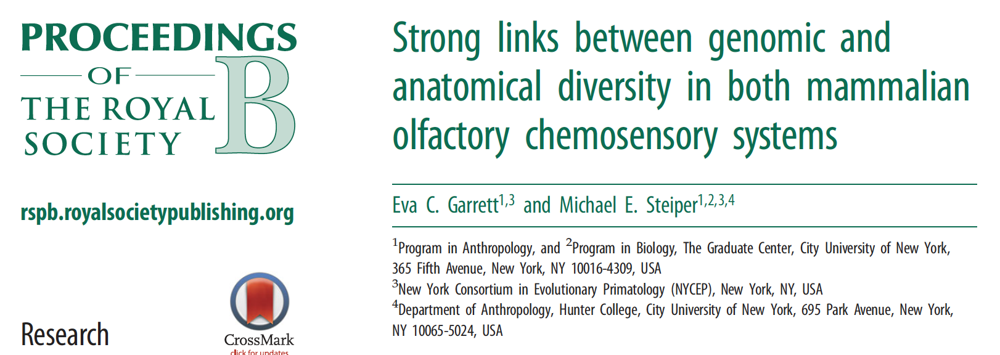
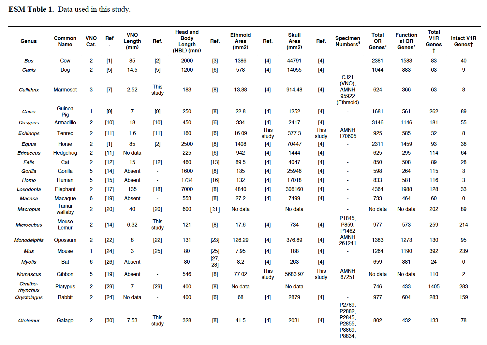
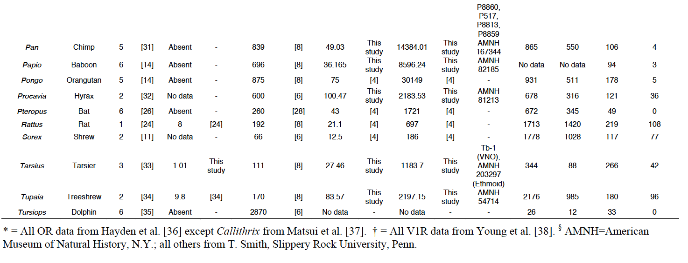

At last! At long last! Here is my final R project!! After everthing kind of fell apart with my intended project, I am very happy to be replicating a 2014 paper by Eva Garrett and Michael Steiper titled <i>Strong links between genomic and anatomical diversity in both mammalian olfactory chemosensory systems</i>. This paper tested the relationships between the sizes of several skeletal structures and organs linked to the main olfactory and vomeronasal systems (MOS and VNS, respectively), as well as the number of both functional and total olfactory receptor (OR) or vomeronasal (V1R) genes (depending on the system). Additionally, all regressions were controlled for phylogenetic relatedness by using the phylogenetic least squares (PGLS) function from the caper package, which works by combining quantitative data with a phylogenetic tree (which I will provide on my GitHub repo). The paper concluded that the variation in MOS anatomical phenotypes is correlated more with total number of olfactory genes and gene family size, while variation in the VNS anatomical phenotypes is correlated more with the number of functional genes. I am going to attemp to replicate these results. 

##Preliminaries

Before I could begin this project in my R space, I had to take a few initial steps that I feel I should mention. First of all, Eva gave me the data in a PDF format, so I had to painstakingly convert the it to an Excel spreadsheet, reformat the entire dataset, check my work against the original to make sure all the values were correct, and convert that again to a CSV file that I can upload here. Additionally, in this process I deleted a few columns of data that I deemed unnecessary for my final dataset, which consisted of columns denoting specimen numbers for the anatomical samples and reference numbers for data citing. Below are pictures of the unedited dataset in PDF format.




##First Steps

Now, we are ready to read in my data and start the real work. For now we will start by loading in just the CSV file, because we need to add some additional columns to the dataset before we can do our PGLS. I have included this dataset in my GitHub repo for this project, so you can use a curl command to load it. 
<br> Just a disclaimer, an artifact of having to transform this data from a PDF format is that there's some steps we will have to take to clean up the data more one we load it. 

```{r}
Olfaction <- read.csv(file="ESM_ALL GOOD ONE.csv", header=TRUE, sep=",")
head(Olfaction)
```

Now, we need to transform some of our morphological data. Garrett and Steiper transformed their data in a few ways. The first that I will do is to calculate and make a new column for the size-adjusted VNO and ethmoid area. 
<br>From the paper: "Size adjusted VNO data was calculated by dividing VNO length by head-body length"
<br> This is going to be a little bumpy, because converting data classes without fucking up your data is more complicated than it should be. Thanks to stack overflow for teaching me the unfactor() function from the varhandle package.
```{r}
library(varhandle)
#First, we need to change the class of the data

Olfaction$VNO.Length..mm. <- unfactor(Olfaction$VNO.Length..mm.)
Olfaction$VNO.Length..mm. <- as.numeric(Olfaction$VNO.Length..mm.)

Olfaction$Head.and.Body.Length..HBL...mm. <- as.numeric(Olfaction$Head.and.Body.Length..HBL...mm.)

#Now we can make the new column

Olfaction$VNO.Size.Adj <- Olfaction$VNO.Length..mm. / Olfaction$Head.and.Body.Length..HBL...mm.

```

Now, I will do the same for size adjusted ethmoid area. 
<br> From the paper: "Size adjusted ethmoid area was calculated by dividing ethmoid area by skull area"

```{r}
#Same as above, first, we need to change the class of the data
Olfaction$Ethmoid.Area..mm2. <- unfactor(Olfaction$Ethmoid.Area..mm2.)
Olfaction$Ethmoid.Area..mm2. <- as.numeric(Olfaction$Ethmoid.Area..mm2.)

Olfaction$Skull.Area..mm2. <- unfactor(Olfaction$Skull.Area..mm2.)
Olfaction$Skull.Area..mm2. <- as.numeric(Olfaction$Skull.Area..mm2.)

#Now we can make the new column

Olfaction$Ethmoid.Size.Adj <- Olfaction$Ethmoid.Area..mm2. / Olfaction$Skull.Area..mm2.

#Now take a look at our two new columns! 
head(Olfaction)
```

Next, we need to add a column for log-transformed ethmoid area, log-transformed VNO length, and log-transformed size-adjusted ethmoid area. They did not use a log-transformation for the size-adjusted VNO length in any of their PGLS calculations. 
<br>From the paper: "We(...)implemented the natural log transformation for non-corrected anatomical variables. When calculating the natural log transformation for VNO length we added one to our variable prior to transforming so all values were positive."
<br>I took a small liberty with this part, because I added 1 to the log size-adjusted ethmoid as well, so all the values were positive. 

```{r}
#For log ethmoid area: 

Olfaction$log.Ethmoid.Area <- log(Olfaction$Ethmoid.Area..mm2.)

#For log size-adjusted ethmoid area, using log1p to add 1:

Olfaction$log.Size.Adj.Ethmoid <- log1p(Olfaction$Ethmoid.Size.Adj)

#For log size-adjusted VNO, using log1p to add 1:

Olfaction$log.VNO <- log1p(Olfaction$VNO.Length..mm.)

#Now look at our new columns!

head(Olfaction)
```

Finally, we need to add two last columns. Not only did Garrett and Steiper test relationships with the numbers of intact V1R genes and number of functional OR genes, but they tested relationships with the proportions of intact V1R genes/functional OR genes out of the total number of V1R/OR genes. So, I will add two columns for the proportion of OR genes that are functional, and the proportion of V1R genes that are intact. I will do this by using basically the same method for making the size-adjusted VNO/ethmoid columns. I will start with OR genes.

```{r}
#First, convert data class

Olfaction$Functional.OR.Genes <- unfactor(Olfaction$Functional.OR.Genes)
Olfaction$Functional.OR.Genes <- as.numeric(Olfaction$Functional.OR.Genes)

Olfaction$Total.OR.Genes <- unfactor(Olfaction$Total.OR.Genes)
Olfaction$Total.OR.Genes <- as.numeric(Olfaction$Total.OR.Genes)

#Now we can make the new column

Olfaction$prop.functional.OR.Genes <- Olfaction$Functional.OR.Genes / Olfaction$Total.OR.Genes

```

Now, I will do the same with V1R gene count: 

```{r}
#First, convert data class

Olfaction$Intact.V1R.Genes <- as.numeric(Olfaction$Intact.V1R.Genes)

Olfaction$Total.V1R.Genes <- as.numeric(Olfaction$Total.V1R.Genes)

#Now we can make the new column

Olfaction$prop.intact.V1R.genes <- Olfaction$Intact.V1R.Genes / Olfaction$Total.V1R.Genes

#Now, let's look at our two new colums!
head(Olfaction)
```

The laast step that I want to do before PGLS is replace the NA values with 0. I will do this here: 

```{r}
Olfaction[is.na(Olfaction)] <- 0.000000
```

Now, at long last, we are ready for PGLS!!!

##PGLS Analysis

